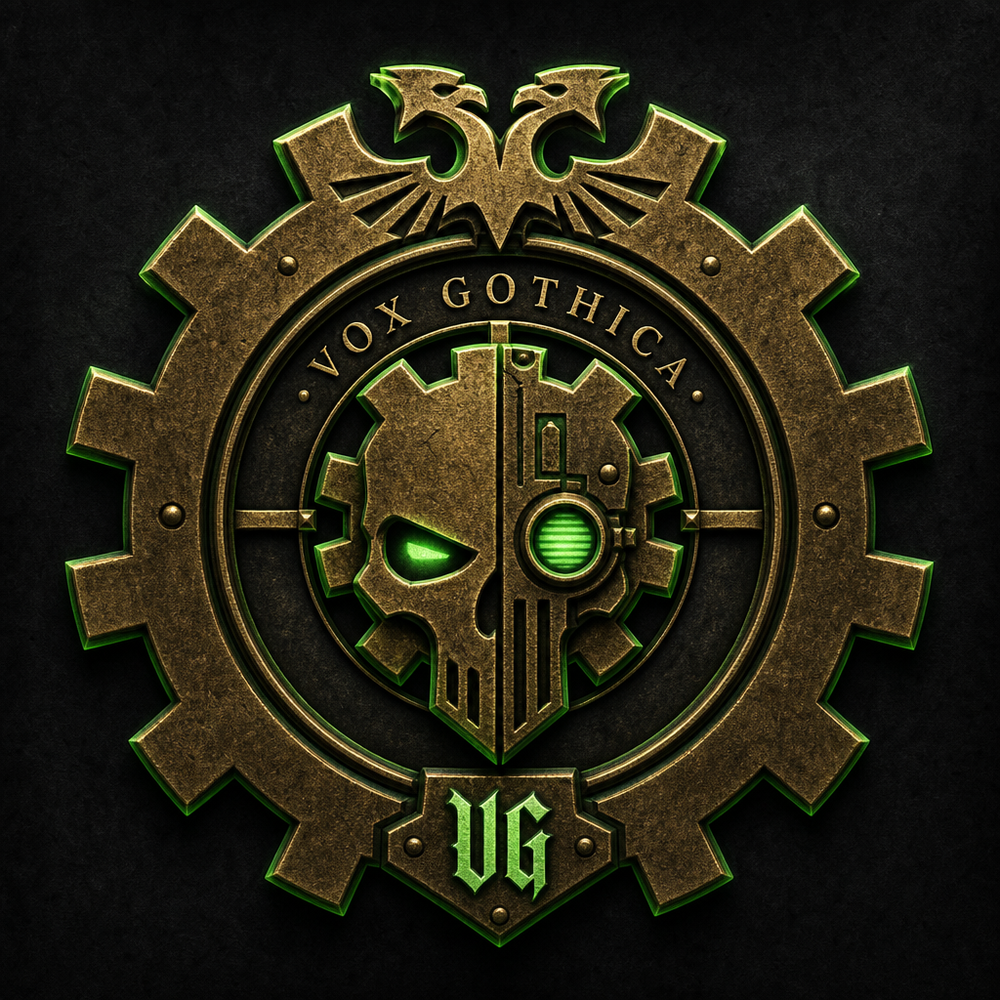

# Vox Gothica

<p align="center">
  
</p>

**A High Gothic programming language for canticles and fabricae** — an esolang in the
tradition of the Adeptus Mechanicus, with a real Python toolchain (`gothica`) and
Terraform-backed *fabricae*.

[](LICENSE)
[](https://github.com/adeptusprogus/vox-gothica/releases)
[](https://adeptusprogus.github.io/vox-gothica/)
[](https://github.com/adeptusprogus/vox-gothica/releases)

> *From the weakness of the flesh — the Machine delivers us.*

---

## Table of contents

- [What is this?](#what-is-this)
- [Requirements](#requirements)
- [Install](#install)
  - [One-liner (recommended)](#one-liner-recommended)
  - [Manual download](#manual-download)
  - [Docker (all platforms)](#docker-all-platforms)
- [Quick start](#quick-start)
- [CLI reference](#cli-reference)
- [Documentation](#documentation)
- [Development](#development)
- [Repository layout](#repository-layout)
- [Status](#status)
- [Contributing](#contributing)
- [License](#license)

---

## What is this?

**Vox Gothica** (`.vg`) is a programming language whose source reads as pseudo-Latin
liturgy of the Adeptus Mechanicus. One syntax, two purposes:

| Rite | Header | What it does |
|------|--------|--------------|
| **Canticle** | `CANTICUM "name".` | General-purpose programs — functions (*rites*), records (*schemas*), errors (*heresies*), modules |
| **Fabrica** | `FABRICA "name".` | Infrastructure manifests → **Terraform JSON** — chanting genuinely raises cloud machines |

```vg
AVE OMNISSIAH.
CANTICUM "salutatio".

VOCIFERO "Ave, Imperium!"
```

```console
$ gothica invoco salutatio.vg
Ave, Imperium!
++ The rite concludes. The Machine Spirit is appeased. ++
```

The toolchain **`gothica`** ships as a **self-contained binary** (~8–20 MB) — **no Python required** to run programs.

---

## Requirements

| | Default install (binary) | Build from source |
|---|---------------------------|-------------------|
| **Python** | not needed | 3.10+ |
| **curl** (macOS/Linux) or **PowerShell** (Windows) | yes | — |
| **Terraform** | only for *fabricae* | only for *fabricae* |
| **Disk** | ~20 MB | ~5 MB + Python |

---

## Install

### One-liner (recommended)

**macOS / Linux** — downloads the latest [GitHub Release](https://github.com/adeptusprogus/vox-gothica/releases) binary:

```console
curl -fsSL https://raw.githubusercontent.com/adeptusprogus/vox-gothica/main/vox-gothica/install.sh | bash
```

**Windows (PowerShell):**

```powershell
irm https://raw.githubusercontent.com/adeptusprogus/vox-gothica/main/vox-gothica/install.ps1 | iex
```

**Verify:**

```console
gothica versio
```

Pin a version: `bash install.sh --version v0.2.0` · Windows: `.\install.ps1 -Version v0.2.0`

---

### Manual download

Get the binary for your platform from **[Releases](https://github.com/adeptusprogus/vox-gothica/releases)**:

| File | Platform |
|------|----------|
| `gothica-darwin-arm64` | macOS Apple Silicon |
| `gothica-darwin-amd64` | macOS Intel |
| `gothica-linux-amd64` | Linux x86_64 |
| `gothica-windows-amd64.exe` | Windows x86_64 |

```console
chmod +x gothica-darwin-arm64    # macOS/Linux
mv gothica-darwin-arm64 ~/.local/bin/gothica
export PATH="$PATH:$HOME/.local/bin"
gothica versio
```

On macOS, if Gatekeeper blocks the binary:

```console
xattr -dr com.apple.quarantine ~/.local/bin/gothica
```

---

### Platform notes

<details>
<summary><strong>macOS</strong> — install.sh details</summary>

Installs to `~/.local/bin/gothica`. Add to `~/.zshrc`:

```console
export PATH="$PATH:$HOME/.local/bin"
```

</details>

<details>
<summary><strong>Linux</strong> — install.sh details</summary>

Same as macOS. Requires `curl`. For ARM Linux, use `--from-source` until an ARM build is published.

</details>

<details>
<summary><strong>Windows</strong> — install.ps1 details</summary>

Installs to `%LOCALAPPDATA%\Programs\gothica\gothica.exe` and adds it to user PATH.

</details>

<details>
<summary><strong>Build from source</strong> (needs Python 3.10+)</summary>

```console
git clone https://github.com/adeptusprogus/vox-gothica.git
cd vox-gothica/vox-gothica
./install.sh --from-source          # macOS/Linux
```

```powershell
.\install.ps1 -FromSource           # Windows
```

</details>

---

### Docker (all platforms)

For *fabricae*, the Docker image bundles **gothica + Terraform** — useful when you
do not want to install Terraform locally.

```console
cd vox-gothica
docker build -t vox-gothica .
```

**Plan** (macOS / Linux):

```console
docker run --rm -v "$PWD:/opus" vox-gothica auguro /opus/exempla/fabrica_interretialis.vg
```

**Plan** (Windows PowerShell):

```powershell
docker run --rm -v "${PWD}:/opus" vox-gothica auguro /opus/exempla/fabrica_interretialis.vg
```

**Apply** (with cloud credentials):

```console
docker run --rm -it -v "$PWD:/opus" \
  -e AWS_ACCESS_KEY_ID -e AWS_SECRET_ACCESS_KEY \
  vox-gothica consecro /opus/exempla/fabrica_interretialis.vg --fiat
```

---

### Portable / standalone binary

Official binaries are built on every [release tag](https://github.com/adeptusprogus/vox-gothica/releases) for macOS (arm64 + amd64), Linux, and Windows.

To build locally from source (developers):

| Tier | Command | Result |
|------|---------|--------|
| Release binary | `make binarium` | `dist/gothica` — no Python on target |
| Zipapp | `make pyz` | `dist/gothica.pyz` — needs Python 3.10+ |

---

### Run without installing

For a quick trial or development, no install step:

**macOS / Linux:**

```console
cd vox-gothica
PYTHONPATH=. python3 -m gothica invoco exempla/salutatio.vg
```

**Windows:**

```powershell
cd vox-gothica
$env:PYTHONPATH = "."
python -m gothica invoco exempla\salutatio.vg
```

---

## Quick start

After install, from the `vox-gothica/` directory:

```console
# Hello world
gothica invoco exempla/salutatio.vg

# Roman numerals & lists
gothica invoco exempla/litania_numerorum.vg

# Run the test suite
gothica proba --dir demo/probationes

# Emit Terraform JSON (no cloud credentials needed)
gothica scribe-solum exempla/fabrica_interretialis.vg
```

Create your own canticle — save as `meum.vg` anywhere:

```vg
AVE OMNISSIAH.
CANTICUM "meum".

VOCIFERO "Ave, Omnissiah!"
```

```console
gothica invoco meum.vg
```

---

## CLI reference

| Command | Action |
|---------|--------|
| `gothica invoco file.vg` | Run a CANTICUM |
| `gothica proba --dir probationes` | Run `*_proba.vg` test litanies |
| `gothica scribe-solum fabrica.vg` | Emit `.tf.json` only |
| `gothica auguro fabrica.vg` | `terraform plan` |
| `gothica consecro fabrica.vg` | `terraform apply` — type **FIAT** (`--fiat` to skip) |
| `gothica exterminatus fabrica.vg` | `terraform destroy` — type **EXTERMINATUS** (no bypass) |
| `gothica versio` | Toolchain version |

**Global flags:** `--silens` (no liturgy) · `--profanum` / `--profanum=json` (CI diagnostics) · `-postulatum k=v` (Fabrica variables; also `GOTHICA_POSTULATUM_<NAME>` env vars)

Full spec: [Mandata (Ch. XII)](https://adeptusprogus.github.io/vox-gothica/12-cli.html)

---

## Documentation

The normative language specification is the **[Codex Vox Gothica](https://adeptusprogus.github.io/vox-gothica/)**:

| Chapter | Topic |
|---------|-------|
| [Porta Librarii](https://adeptusprogus.github.io/vox-gothica/) | Index |
| [Prooemium](https://adeptusprogus.github.io/vox-gothica/prooemium.html) | Design principles |
| [Codex Hereticus](https://adeptusprogus.github.io/vox-gothica/06-heresies.html) | Error taxonomy |
| [Fabrica](https://adeptusprogus.github.io/vox-gothica/10-fabrica.html) | Infrastructure → Terraform |
| [Mandata](https://adeptusprogus.github.io/vox-gothica/12-cli.html) | CLI & diagnostics |
| [Glossarium](https://adeptusprogus.github.io/vox-gothica/15-glossary.html) | Keywords |

Source HTML: [`docs/`](docs/) · Wiki quick-ref: [`wiki/`](wiki/)

---

## Development

```console
cd vox-gothica
python3 -m venv .venv
```

**macOS / Linux:** `source .venv/bin/activate`  
**Windows:** `.\.venv\Scripts\Activate.ps1`

```console
pip install -e .
make proba          # run full test suite
make pyz            # build dist/gothica.pyz
make docker         # build Docker image
```

Toolchain internals: [`vox-gothica/README.md`](vox-gothica/README.md) · architecture: [Instrumenta (Ch. XIV)](https://adeptusprogus.github.io/vox-gothica/14-implementation.html)

---

## Repository layout

```
vox-gothica/
├── README.md              ← you are here
├── CONTRIBUTING.md        ← PR workflow & Ordo Branchium
├── docs/                  ← Codex Vox Gothica (GitHub Pages)
├── wiki/                  ← GitHub Wiki markdown sources
└── vox-gothica/           ← gothica toolchain
    ├── gothica/           ← Python package (lexer, parser, interpreter, fabrica)
    ├── exempla/           ← runnable examples
    ├── demo/              ← sample project + probationes/
    ├── install.sh         ← macOS & Linux installer
    ├── install.ps1        ← Windows installer
    ├── Dockerfile         ← gothica + Terraform image
    └── Makefile           ← proba / pyz / binarium / docker
```

---

## Status

**v0.2.0 — Second Canticle**

| ✅ Shipped | 🚧 Planned (M4–M6) |
|-----------|-------------------|
| Lexer, parser, interpreter | Litania package manager (`adfero` / `offero`) |
| Modules, stdlib, test runner | `purga` formatter, `lustro` linter |
| Fabrica → Terraform JSON | Static checker, conformance suite |
| Plan / apply / destroy driver | Go/Rust port |

---

## Collegium Magorum

<!-- collegium:start — auto-generated by sync-collegium.py; edit contributors.json for titles -->

| | |
|---|---|
| [**EduardL**](https://github.com/adeptusprogus) | Archmagos Auctor — Founder of the Rite |
| **Claude Fable** | Magos Errant — Cogitator-Artisan of the First Canticle |
| [**abyssmemes**](https://github.com/abyssmemes) | Magos — Contributor to the Rite |
<!-- collegium:end -->

---

## Contributing

Pull requests welcome. Read **[CONTRIBUTING.md](CONTRIBUTING.md)** for:

- **Ordo Branchium** — branch naming (`cantica/`, `purgatio/`, `codex/`, …)
- PR + green CI required on `main`
- Automated inquisitor — wrong branch names get *HERESY DETECTA*

Quick ref: [.github/BRANCH_POLICY.md](.github/BRANCH_POLICY.md)

---

## License

[GNU General Public License v3.0](LICENSE)

*The flesh is weak; the toolchain is versioned.*
